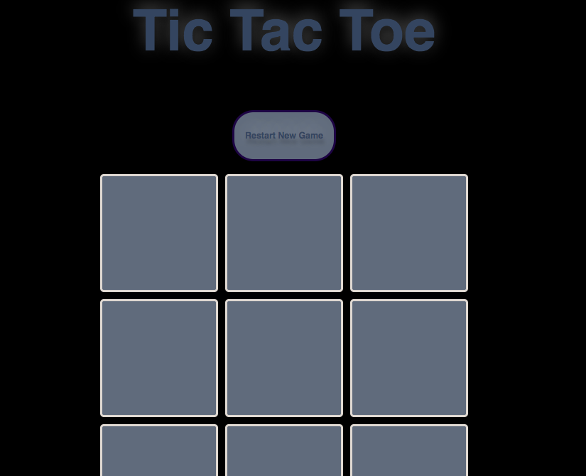
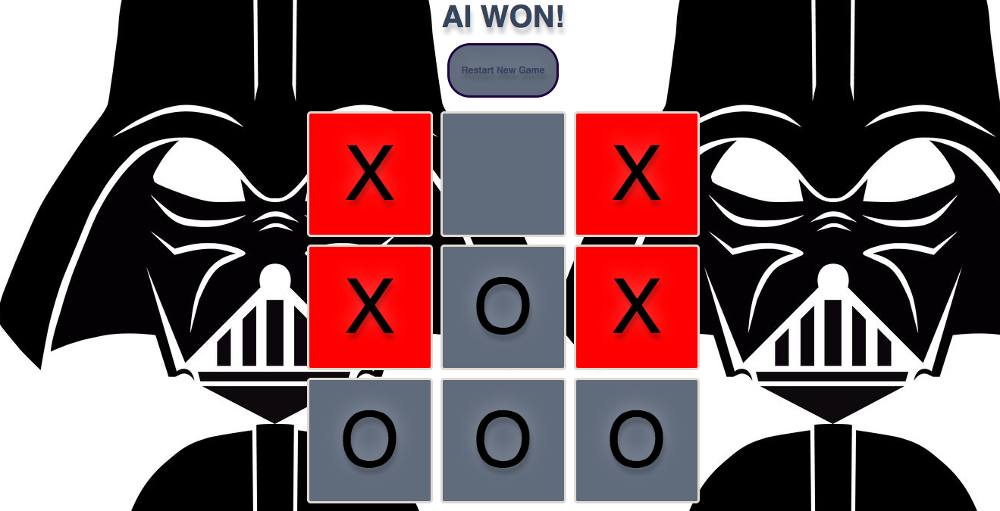
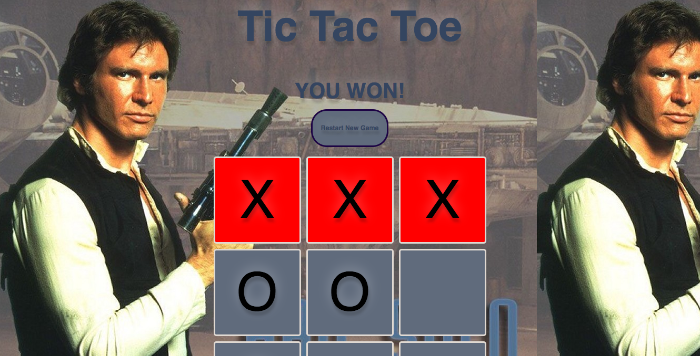

### Star Wars Tic Tac Toe

[Link to My Game Here](http://tictactoe-starwars.bitballoon.com/)




I used the following languages to build my game:

* HTML
* CSS
* Javascript


#### User Versus an AI:

- A user X plays against an AI 
- A random number is generated for the AI. The AI picks a square from 0-8
- If the AI wins, the background changes to Darth Vader.





### Algorithm I wrote to create "A.I."

```
function createAiCellAttribute() {

function aiChoice () {
  var btnNum = Math.round(Math.random() * 8);
  return btnNum;
}

var btnNum = aiChoice();

function isPlayed () {
  for (var i = 0; i < btnsPlayed.length; i++) {
    while (btnNum === btnsPlayed[i]) {
      btnNum = aiChoice();
      isPlayed();
    }
  }
  return btnNum;
}

var cellNum = isPlayed();

function addtoBtnsPlayed () {
  btnsPlayed.push(cellNum);
  return btnsPlayed;
}

addtoBtnsPlayed();


var cellNumStr = cellNum.toString();

function setMatrixValue(str) {
if (str === '0') {
  btnValue.btn0 = 0;
} else if (str === '1') {
  btnValue.btn1 = 0;
} else if (str === '2') {
  btnValue.btn2 = 0;
} else if (str === '3') {
   btnValue.btn3 = 0;
} else if (str === '4') {
  btnValue.btn4 = 0;
} else if (str === '5') {
  btnValue.btn5 = 0;
} else if (str === '6') {
  btnValue.btn6 = 0;
} else if (str === '7') {
  btnValue.btn7 = 0;
} else if (str === '8') {
  btnValue.btn8 = 0;
} else  {
  return btnValue;
}
}

setMatrixValue(cellNumStr)

 if (btnsPlayed.length < 9) {
  var textNode = document.createTextNode("O");
  document.getElementById(cellNumStr).appendChild(textNode);
}

};
        ```


